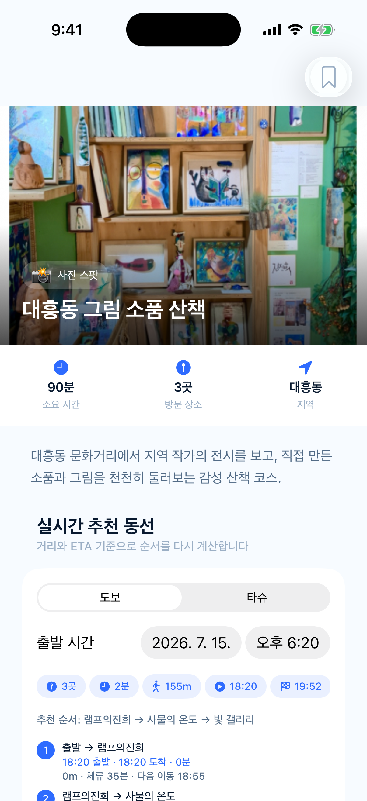

# 놀거많은대?전

> 대전의 한 곳 방문을 골목 전체의 경험으로 이어주는 iOS 로컬 탐방 앱

`SwiftUI` 기반으로 대전의 놀거리, 먹거리, 카페, 축제, 관광지, 체험 공간을 검색하고 스토리와 테마 코스로 탐색하는 MVP입니다. 사용자에게는 "대전에서 뭐 하지?"의 답을, 소상공인에게는 가게의 이야기가 방문 동선에 편입되는 접점을 제공합니다.

<p align="center">
  
  
  
</p>

## 제품 핵심

| 문제 | 놀거많은대?전의 해법 |
| --- | --- |
| 대전의 유명 장소 이후 일정을 찾는 데 시간이 걸린다. | 장소명, 카테고리, 지역, 설명, 태그를 한 번에 검색하고 상황별 코스를 제안합니다. |
| 검색 상위 장소에 방문이 집중되고 골목 가게는 발견되기 어렵습니다. | 점주의 사진과 창업 이야기를 검색 가능한 스토리로 구조화하고 주변 가게와 함께 코스에 연결합니다. |
| 가고 싶은 곳을 찾아도 실제 이동 순서를 다시 정리해야 합니다. | `MapKit` 기반 도보·타슈 이동 경로와 ETA를 반영해 코스 순서를 재계산합니다. |
| 소상공인이 앱 노출의 효과를 확인하기 어렵습니다. | 코스 노출, 저장, 방문 이벤트를 기반으로 한 사장님 대시보드 프로토타입을 제공합니다. |

## 주요 기능

- **통합 검색과 필터**: 검색어와 카테고리를 `AND` 조건으로 적용합니다.
- **대전 지도 탐색**: 장소, 타슈 대여소, 위치 핀, 경로 탐색을 한 화면에 구성합니다.
- **상황형 코스**: 데이트, 혼자 걷기, 야간, 비 오는 날, 사진, 맛집 테마를 지원합니다.
- **ETA 기반 동선**: 실제 도로 기준의 이동 시간과 체류 시간을 합산해 출발·도착 시간을 제안합니다.
- **가게 스토리**: 창업 배경, 공간 철학, 대표 상품, 방문 팁, 실제 점주 제공 이미지를 상세 화면에 전달합니다.
- **저장·방문·보상**: `UserDefaults`로 저장, 방문, 스탬프, 뱃지 상태를 유지합니다.
- **소상공인 대시보드**: 재현 가능한 예시 데이터로 KPI, 유입 경로, 시간대·계절 추이를 시연합니다.

## 실제 소상공인 케이스

`store-013` **램프의진희**는 점주가 제공한 소개 글과 사진 8장을 기반으로 구성한 실제 콘텐츠 적용 사례입니다. 2012년 8월 16일 대흥동 문화거리에서 시작한 그림·공방·소품 공간의 이야기를 상세 페이지와 90분 코스 **대흥동 그림 소품 산책**에 연결했습니다.

[램프의진희 콘텐츠 전환 사례 보기](docs/product/MERCHANT_CASE.md)

## 시스템 구성



SwiftUI 화면과 `AppState`가 사용자 상태를 관리하고, `DataServiceProtocol`이 현재 `MockDataService`와 향후 `Supabase` 전환 경계를 만듭니다. 지도·경로는 `MapKit`, 로컬 저장은 `UserDefaults`, 선택적 이미지 보완은 카카오 이미지 검색 API를 사용합니다.

[아키텍처 및 데이터 모델 상세 보기](docs/ARCHITECTURE.md)

## 빠른 시작

### 요구 환경

- macOS
- Xcode 16 이상
- iOS 17 이상 Simulator 또는 실기기
- Mermaid 이미지를 재생성할 경우 Node.js 20 이상

### Xcode 실행

```bash
open NolgoManyDJ.xcodeproj
```

Xcode에서 `NolgoManyDJ` scheme과 iPhone Simulator를 선택한 뒤 `Command + R`로 실행합니다.

### CLI 빌드

```bash
xcodebuild \
  -project NolgoManyDJ.xcodeproj \
  -scheme NolgoManyDJ \
  -configuration Debug \
  -destination 'generic/platform=iOS Simulator' \
  CODE_SIGNING_ALLOWED=NO \
  build
```

### 선택 설정: 카카오 이미지 검색

앱은 API 키 없이도 로컬 에셋과 플레이스홀더로 정상 실행됩니다. 원격 이미지 보완을 활성화하려면 Xcode Target Build Settings에 `KAKAO_REST_API_KEY`를 로컬로 추가하거나 실행 환경 변수로 주입합니다. 키는 소스와 커밋에 포함하지 않습니다.

## 시연 자료 재생성

```bash
# Xcode 빌드, Simulator 실행, 대전 좌표 고정, 12개 화면 캡처
./scripts/capture-screenshots.sh

# Mermaid 원본을 SVG와 PNG로 렌더링
./scripts/render-diagrams.sh
```

기본 캡처 기기는 `iPhone 17 Pro`입니다. 다른 Simulator를 사용하려면 `DEVICE_NAME='iPhone 16 Pro' ./scripts/capture-screenshots.sh`처럼 지정합니다.

## 데이터 상태

| 영역 | 현재 상태 |
| --- | --- |
| 장소 | 22개. 램프의진희는 점주 제공 실자료, 나머지는 사업 검증을 위한 예시·공공 장소 조합 |
| 코스 | 에디터 코스 6개, 공유 경로 예시 5개 |
| 타슈 | 정적 예시 거점 8개. 실시간 재고 API 미연동 |
| 분석 | 가게 ID 기반의 재현 가능한 목 데이터. 실제 POS 또는 방문 집계가 아님 |
| 저장 | 기기 내 `UserDefaults`. 계정 동기화와 Supabase는 전환 예정 |

[데이터 출처·신뢰도 기준 보기](docs/product/DATA_STATUS.md)

## 문서

- [전체 화면 캡처](docs/SCREENSHOTS.md)
- [제품 정의와 기능 상태](docs/product/PRODUCT.md)
- [램프의진희 실제 콘텐츠 사례](docs/product/MERCHANT_CASE.md)
- [시스템 아키텍처](docs/ARCHITECTURE.md)
- [Mermaid 다이어그램](docs/diagrams/README.md)
- [발표 PPT 설계 마스터 프롬프트](docs/presentation/PPT_MASTER_PROMPT.md)

## 주요 확장 과제

1. Supabase Auth·DB·Storage와 RLS를 연동해 콘텐츠와 사용자 상태를 서버로 전환합니다.
2. 점주 동의, 콘텐츠 검수, 수정 이력을 포함한 온보딩 프로세스를 제품화합니다.
3. 조회, 저장, 코스 시작, 지도 행동, 인증 방문을 이벤트로 수집해 대시보드를 실데이터로 교체합니다.
4. 타슈 실시간 재고, 대전 관광·축제 공공데이터를 연동합니다.

> 점주 제공 사진과 서사 콘텐츠는 일반 코드와 다른 권리 속성을 가질 수 있습니다. 재사용·상용 배포 전에 자료 제공자와 사용 범위를 확인하세요.
