# 시스템 아키텍처

## 구조 개요

현재 앱은 외부 패키지 없이 SwiftUI, Observation, MapKit, Charts, UserDefaults로 구성됩니다. 화면과 데이터 경계를 분리해 MVP 시연용 `MockDataService`를 향후 `SupabaseDataService`로 교체할 수 있는 구조를 유지합니다.

| 계층 | 책임 | 현재 구현 |
| --- | --- | --- |
| View | 홈, 지도, 코스, 상세, 저장, 마이, 사장님 대시보드 | SwiftUI View |
| State | 선택 탭, 온보딩, 선호도, 저장, 방문, 보상 진행 | `@Observable AppState` |
| Domain | 가게, 코스, 코스 정류장, 방문, 보상, 점주 분석 | Codable Swift Model |
| Data | 장소·코스 조회 경계 | `DataServiceProtocol`, `MockDataService` |
| Platform | 지도, 경로, ETA, 로컬 영속성, 이미지 보완 | MapKit, UserDefaults, Kakao Image Search |
| Planned Backend | 계정, DB, Storage, 접근 제어 | Supabase 스키마·RLS 초안 |

## 사용자 여정

핵심 단위는 단일 장소 노출이 아니라 `발견 -> 이야기 -> 코스 -> 이동 -> 방문 -> 다음 탐방`으로 이어지는 순환입니다.

1. 사용자가 검색어와 카테고리로 후보를 좁힙니다.
2. 가게 스토리와 방문 팁으로 방문 이유를 확인합니다.
3. 주변 장소가 묶인 테마 코스를 고릅니다.
4. MapKit이 이동 수단, 출발 시간, 체류 시간을 반영해 순서와 ETA를 계산합니다.
5. 저장·방문·완주 상태가 다음 추천과 보상 진행에 반영됩니다.

## 소상공인 콘텐츠 파이프라인

실제 운영에서는 원본 자료를 바로 게시하지 않고 활용 범위 확인, 콘텐츠 구조화, 점주 최종 검수를 거쳐야 합니다. 게시 후에는 조회·저장·코스 시작·인증 방문을 집계해 실제 효과를 확인하는 구조로 확장합니다.

## 데이터 모델

`Store` 모델이 스토리, 위치, 운영 정보, 태그, 이미지, 상품을 관리합니다. `Course` 모델은 `CourseStop`을 통해 여러 가게를 순서가 있는 경험으로 묶습니다. 사용자 저장과 방문은 현재 로컬 상태이지만, Supabase 전환 시 별도 관계 테이블로 분리할 수 있도록 스키마를 준비했습니다.

## 비즈니스 생태계

| 구분 | 제공 가치 | 수익화 가설 |
| --- | --- | --- |
| B2C 사용자 | 탐색 시간 절감, 새로운 로컬 발견, 실행 가능한 동선 | 프리미엄 코스·패스, 제휴 체험 판매 |
| B2B 소상공인 | 스토리 제작, 코스 편입, 유입 효과 확인 | 초기 무료 입점 후 프로모션·광고·분석 구독 |
| B2G 지자체·관광기관 | 상권 분산, 테마 코스, 캠페인, 집계 인사이트 | 콘텐츠 구축·캠페인 운영·대시보드 용역 |

위 수익화 항목은 현재 검증 전 가설입니다. 실제 과금은 무료 입점으로 콘텐츠 풀과 방문 신호를 먼저 확보한 뒤 선택형 유료 기능의 지불 의사를 검증해야 합니다.

## 보안과 외부 설정

- 외부 API 키는 소스에 저장하지 않고 `KAKAO_REST_API_KEY` 빌드 설정 또는 실행 환경으로 주입합니다.
- 키가 없을 때 이미지 검색은 빈 결과를 반환하고, 앱은 로컬 에셋·플레이스홀더로 계속 동작합니다.
- Supabase 전환 시 공개 조회 데이터와 사용자별 저장·방문 데이터를 RLS로 분리해야 합니다.
- 점주 콘텐츠는 원본 제공, 가공, 검수, 게시, 수정 이력을 남겨야 합니다.

## 시연 자동화 경계

`NolgoManyDJApp.swift`의 `ScreenshotScene`은 문서용 화면을 재현하기 위한 Debug 전용 진입점입니다. 검색어, 선택 카테고리, 저장 목록, 방문 상태를 결정적으로 주입하여 캡처 표현의 드리프트를 줄입니다. Release 빌드에서는 해당 코드가 제외됩니다.
