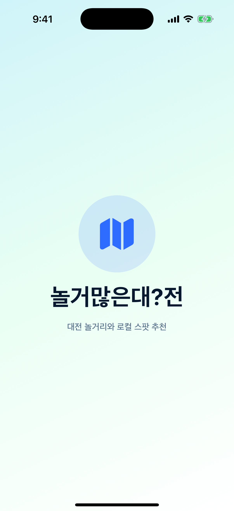
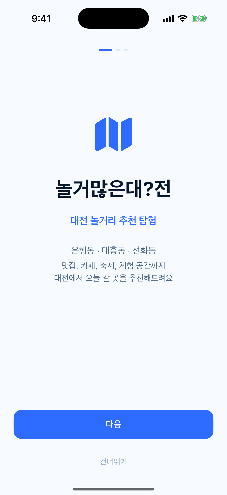
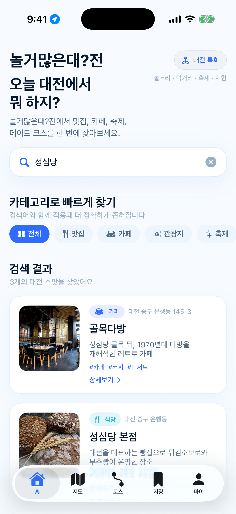
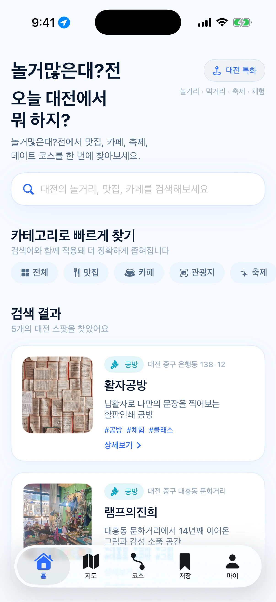
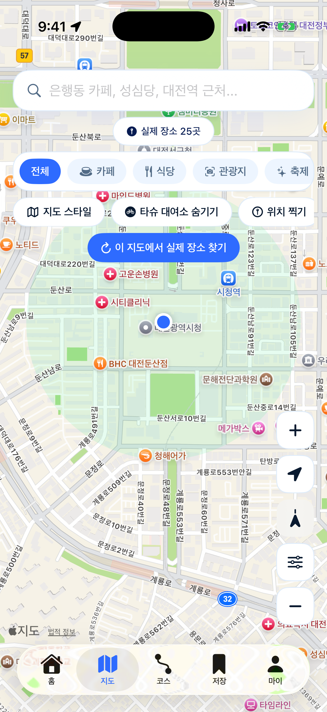
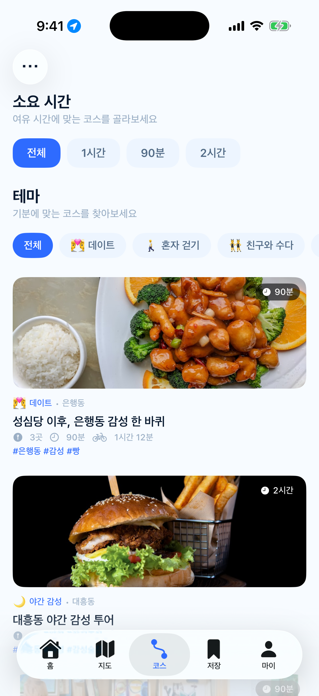
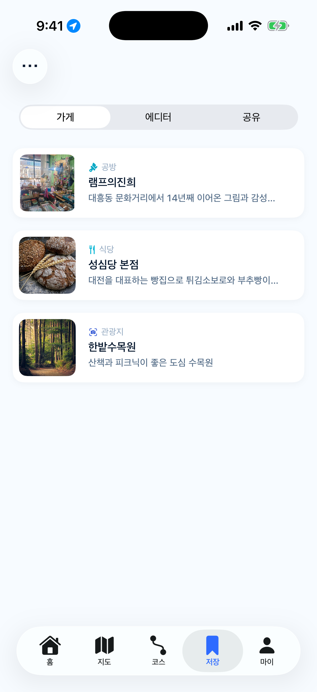
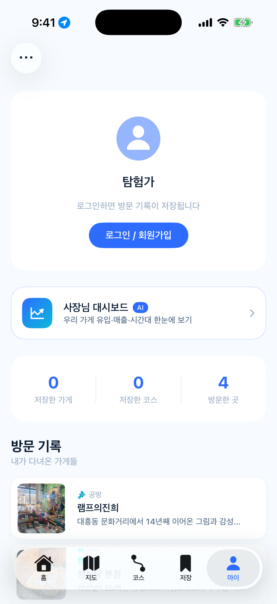
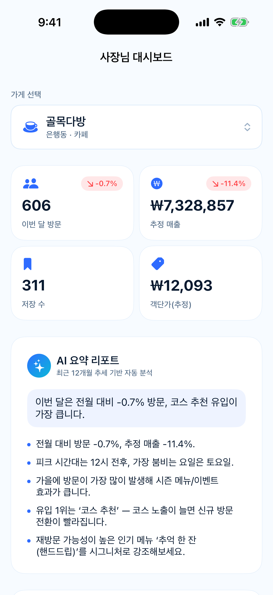

# 앱 화면 캡처

Xcode Debug 빌드를 iPhone 17 Pro Simulator에 실행해 캡처한 현재 MVP 화면입니다. `DEBUG` 전용 시연 scene을 사용하므로 저장소에서 동일한 상태를 재생성할 수 있습니다.

## 첫 진입과 탐색

<table>
  <tr>
    <th width="25%">Splash</th>
    <th width="25%">온보딩</th>
    <th width="25%">홈</th>
    <th width="25%">실시간 검색</th>
  </tr>
  <tr>
    <td></td>
    <td></td>
    <td></td>
    <td></td>
  </tr>
  <tr>
    <td>브랜드명과 대전 로컬 추천 정체성</td>
    <td>선호 테마와 연령대 설정</td>
    <td>검색, 카테고리, 추천 콘텐츠 대시보드</td>
    <td>장소명·설명·태그에서 `성심당` 필터링</td>
  </tr>
</table>

## 필터·지도·코스

<table>
  <tr>
    <th width="25%">카테고리 필터</th>
    <th width="25%">대전 지도</th>
    <th width="25%">코스 탐색</th>
    <th width="25%">ETA 코스 상세</th>
  </tr>
  <tr>
    <td></td>
    <td></td>
    <td></td>
    <td></td>
  </tr>
  <tr>
    <td>`체험` 분류에 해당하는 공방·활동 장소</td>
    <td>대전 좌표, 근처 타슈, 지도 행동</td>
    <td>테마·소요 시간 기반 추천</td>
    <td>도보·타슈 기준 순서, ETA, 체류 시간</td>
  </tr>
</table>

## 로컬 스토리와 사용자·점주 화면

<table>
  <tr>
    <th width="25%">실제 가게 스토리</th>
    <th width="25%">저장</th>
    <th width="25%">마이 페이지</th>
    <th width="25%">사장님 대시보드</th>
  </tr>
  <tr>
    <td></td>
    <td></td>
    <td></td>
    <td></td>
  </tr>
  <tr>
    <td>점주 제공 사진·서사를 반영한 `램프의진희`</td>
    <td>가게, 코스, 공유 경로 저장</td>
    <td>방문, 완주, 스탬프, 뱃지 진행</td>
    <td>목 집계로 구성한 B2B 분석 프로토타입</td>
  </tr>
</table>

## 재생성 방법

```bash
./scripts/capture-screenshots.sh
```

스크립트는 다음을 자동으로 수행합니다.

1. Xcode 프로젝트와 Simulator를 엽니다.
2. Debug 앱을 빌드·설치합니다.
3. 위치 권한을 부여하고 대전시청 인근 좌표 `36.3504, 127.3845`를 설정합니다.
4. 12개 `--screenshot-scene` 상태를 순차 실행해 PNG로 저장합니다.

`ScreenshotScene`은 `#if DEBUG`에서만 컴파일되므로 Release 앱 진입 흐름에 영향을 주지 않습니다.
