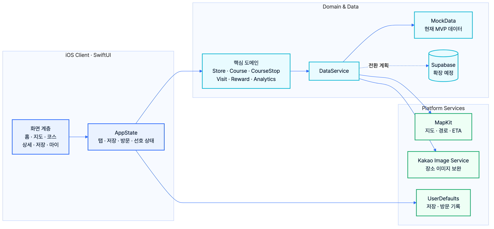

# Mermaid 다이어그램

모든 다이어그램은 수정 가능한 `.mmd` 원본과 GitHub·PPT에 사용할 `.svg`, `.png` 산출물을 함께 관리합니다.

| 다이어그램 | 용도 | 원본 |
| --- | --- | --- |
| 시스템 아키텍처 | iOS, 도메인, 데이터, 플랫폼 경계 | [`system-architecture.mmd`](system-architecture.mmd) |
| 사용자 여정 | 발견에서 방문·재탐방까지의 흐름 | [`user-journey.mmd`](user-journey.mmd) |
| 점주 콘텐츠 파이프라인 | 자료 제공에서 효과 확인까지의 운영 흐름 | [`merchant-content-pipeline.mmd`](merchant-content-pipeline.mmd) |
| 데이터 모델 | Store, Course, User, Visit, Reward 관계 | [`data-model.mmd`](data-model.mmd) |
| B2C·B2B·B2G 생태계 | 사용자, 소상공인, 지자체, 상권의 가치 교환 | [`business-ecosystem.mmd`](business-ecosystem.mmd) |

## 렌더링

```bash
./scripts/render-diagrams.sh
```

스크립트는 `@mermaid-js/mermaid-cli` 11.16.0을 고정해 각 원본을 투명 배경 SVG와 흰색 배경 고해상도 PNG로 생성합니다. 발표 자료에는 PNG, GitHub 문서에는 SVG 사용을 권장합니다.

<p align="center">
  
</p>
