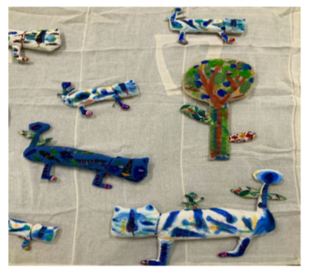
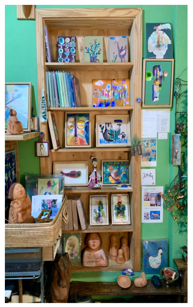
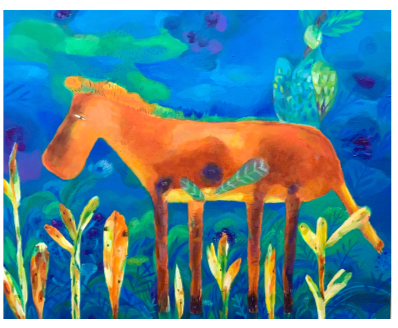
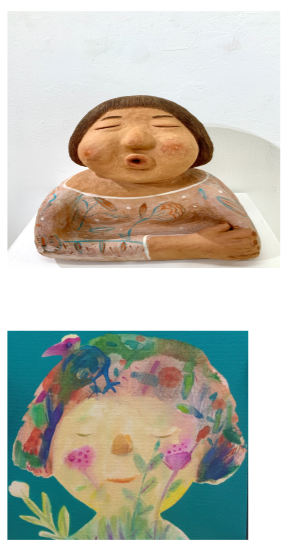
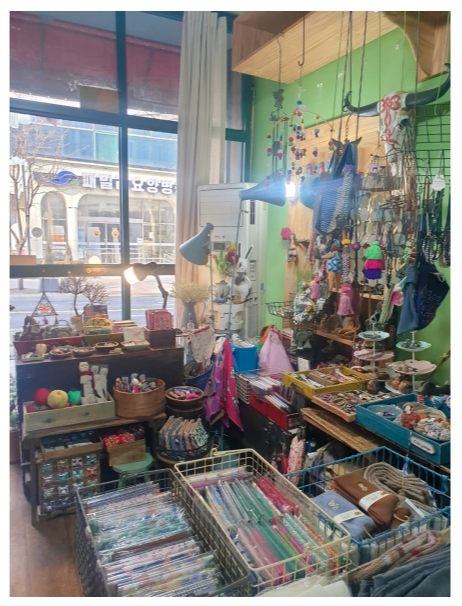
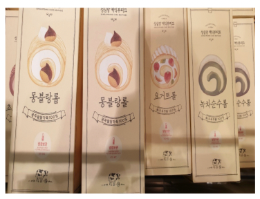
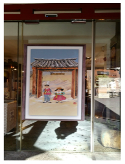
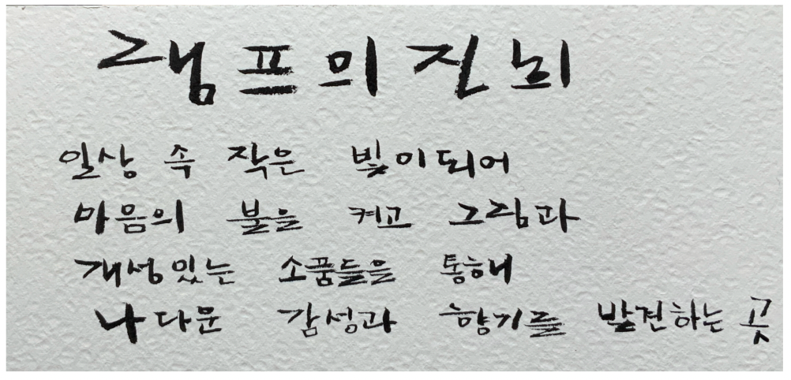

# 실제 점주 콘텐츠 적용 사례: 램프의진희

## 원본을 앱 경험으로 바꾼 방법

램프의진희는 실제 점주로부터 받은 가게 소개와 이미지를 앱에 반영한 첫 콘텐츠 케이스입니다. 원본을 단순히 옮기지 않고 사용자가 검색하고, 방문 이유를 이해하고, 주변 가게와 함께 다닐 수 있는 구조로 재편집했습니다.

  

## 점주 제공 핵심 내용

| 항목 | 반영 내용 |
| --- | --- |
| 운영 이력 | 2012년 8월 16일 대흥동 문화거리에서 공예 소품샵으로 시작, 2026년 기준 14년째 운영 |
| 공간 정체성 | 각자의 내면에 따뜻한 빛을 밝히는 그림과 감성의 공간 |
| 주요 경험 | 그림 전시·판매, 그림 공방, 캐릭터·공예 소품 탐색 |
| 네이밍 | 소망을 이루어주는 마법의 램프와 작가의 이름 진희를 연결 |
| 방문 팝 | 전시·공방 운영 일정을 미리 확인하고, 작품을 천천히 볼 수 있는 평일 낮에 방문 |

## 콘텐츠 구조화

| 원본 자료 | 데이터 필드 | 앱 표현 |
| --- | --- | --- |
| 14년 운영 이력과 네이밍 이야기 | `founderStory` | 스토리 본문 |
| 그림·공방·소품의 특징 | `signaturePoint`, `menuItems` | 대표 경험·제공 서비스 |
| 대흥동 문화거리 맥락 | `district`, `address`, `tags` | 지역·검색·카테고리 필터 |
| 가게·작품·소품 사진 8장 | `StoreImage` | 히어로·갤러리·카드 이미지 |
| 주변 전시·작가 공간 | `Course`, `CourseStop` | 90분 코스 `대흥동 그림 소품 산책` |

## 앱 데이터 연결

- 가게 ID: `store-013`
- 슬러그: `lamp-jinhee`
- 카테고리: `공방`
- 지역: `대흥동`
- 검색 태그: `대흥동`, `공방`, `그림`, `소품`, `체험`, `전시`, `데이트`, `램프의진희`
- 연결 코스: `course-006` 대흥동 그림 소품 산책
- 코스 구성: 빛 갤러리 -> 램프의진희 -> 온도의상점
- 기본 소요 시간: 90분

## 점주 제공 이미지

<table>
  <tr>
    <th width="25%">패브릭 작업</th>
    <th width="25%">작품·소품 선반</th>
    <th width="25%">그림 작품</th>
    <th width="25%">캐릭터 작품</th>
  </tr>
  <tr>
    <td></td>
    <td></td>
    <td></td>
    <td></td>
  </tr>
  <tr>
    <th>가게 전경</th>
    <th>패키지 작업</th>
    <th>전시 입구</th>
    <th>작가 손글씨</th>
  </tr>
  <tr>
    <td></td>
    <td></td>
    <td></td>
    <td></td>
  </tr>
</table>

## 파일럿

이 사례의 다음 검증은 "상세 페이지가 좋다"는 정성 평가에서 멈추지 않고, 실제 방문 행동으로 연결되는지 확인하는 것입니다.

| 단계 | 집계할 이벤트 | 판정 지표 |
| --- | --- | --- |
| 발견 | 검색 결과 노출, 카드 클릭 | 상세 진입률 |
| 관심 | 저장, 갤러리 열람, 스토리 스크롤 | 저장률, 콘텐츠 완독률 |
| 계획 | 코스 상세 진입, ETA 계산, 지도 열기 | 코스 시작 전환율 |
| 방문 | 위치 인증, 정류장 완료 | 인증 방문률, 다음 정류장 도달률 |
| 재방문 | 재저장, 재방문, 공유 | 30일 재방문률, 추천 전파 |

## 운영 주의사항

- 점주 제공 자료임은 확인되었지만, 저장소 공개·발표·상용 서비스에서의 사용 범위는 별도 동의 기록으로 관리해야 합니다.
- 주소, 전화, 운영 시간, SNS 정보는 배포 전 점주 최종 검수가 필요합니다.
- 현재 상세 화면은 콘텐츠 적용 프로토타입이며, 제휴 계약이나 유료 광고 집행을 의미하지 않습니다.
